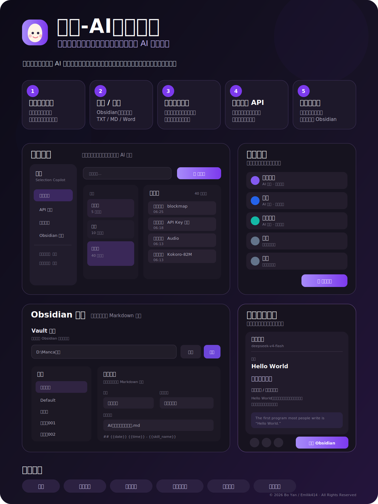

# 饺滑-AI划词助手

**划词、对话、整理、导出，一站式桌面 AI 效率助手**

[下载 Windows 测试版](https://github.com/Emllik414/jiaohua-ai/releases)

## 产品介绍

饺滑是一款面向翻译、阅读、搜索、写作和知识整理场景的 Windows 桌面划词助手。用户在网页或文档中选中文字后，即可快速调用翻译、搜索、辅助阅读、发音、复制等技能，并在独立结果卡片中查看和继续处理内容。

软件会自动保留每一次划词与对话，方便用户搜索、回看、展开、整理和删除历史记录。对话结果既可以直接导入 Obsidian，也支持导入本地文件，并可导出为 TXT、Markdown（MD）和 Word（DOCX）等常用格式，让零散信息持续沉淀为个人知识库。

饺滑支持自定义技能名称、图标、系统提示词和划词提示词。用户可以根据翻译、学习、写作、总结或办公需求建立自己的工作流，并按需配置兼容的 API 服务商和模型，无需被单一平台绑定。官方安装包不内置用户的真实 API Key，密钥由用户自行填写和管理。

## 核心亮点

| 功能 | 说明 |
| --- | --- |
| **划词即用** | 选中文字即可弹出工具条，快速执行 AI 技能或系统操作。 |
| **历史记录自动保存** | 每一次划词和对话都会保留，支持搜索、回看、展开与删除。 |
| **自定义技能与提示词** | 可自定义技能名称、图标、系统提示词和专属划词提示词。 |
| **自由配置 API 服务商** | 可连接和切换兼容的 API 厂家与模型，适配不同任务和预算。 |
| **Obsidian 与本地文件** | 支持导入 Obsidian、导入本地文件，并通过模板整理笔记。 |
| **多格式导出** | 支持导出 TXT、MD、Word（DOCX）等格式。 |
| **结果一键沉淀** | 结果卡片可直接复制、朗读、重新生成或导入 Obsidian。 |
| **浏览器增强** | 配套 Edge / Chrome 扩展，提高网页、字幕和复杂页面的取词准确度。 |

## 界面预览

产品介绍图展示了饺滑的主要使用界面：

- **历史对话**：集中保存和管理每一次划词与 AI 对话。
- **技能管理**：创建技能，自定义系统提示词、划词提示词与图标。
- **Obsidian 导入**：配置 Vault 路径、目标笔记和 Markdown 模板。
- **划词结果卡片**：即时展示处理结果，并提供复制、朗读、重新生成和导入操作。

## 安装与使用

1. 前往 [Releases](https://github.com/Emllik414/jiaohua-ai/releases) 下载 `饺滑-AI划词助手 Setup 0.1.0.exe`。
2. 安装并启动饺滑，在“API 设置”中填写自己的服务商配置和 API Key。
3. 在 Edge 地址栏打开 `edge://extensions`，启用“开发人员模式”。
4. 点击“加载解压缩的扩展”，选择软件安装目录中的 `resources/browser-extension`。
5. 刷新普通网页，划选文字进行测试。

> 当前为 Beta 测试版本，安装包尚未进行代码签名，Windows 可能显示“未知发布者”。`edge://`、浏览器扩展商店等受保护页面无法运行普通扩展。

## 数据与隐私

- 历史记录、技能配置和常用设置主要保存在用户本机。
- API Key 由用户自行配置，官方发布包不应包含开发者或其他用户的真实密钥。
- 使用第三方 API 时，所选文本会依照对应服务商的接口规则发送和处理，请自行阅读相关服务商的隐私政策。

## 技术构成

- Electron + React + TypeScript
- 浏览器扩展：Manifest V3
- 取词候选：Browser Provider、Windows UIA、Clipboard 等
- 文档能力：TXT、Markdown、Word（DOCX）
- 知识库：Obsidian 模板化导入

## 版权与使用限制

**本仓库是源代码可见项目，但不是开源项目。**

Copyright © 2026 Bo Yan / Emllik414. All Rights Reserved.

未经版权所有者事先书面许可，禁止：

- 修改、改编、翻译或创建衍生作品；
- 商业使用、销售、出租、收费服务或其他营利用途；
- 复制后重新发布、分发、转售、镜像、重新打包或二次发布；
- 删除或更改版权、品牌及来源说明；
- 将代码、界面、图标、截图或产品素材用于其他产品。

官方发布的、未经修改的安装包仅允许个人非商业下载、安装和使用。完整条款见 [LICENSE](LICENSE)。

> Obsidian、Microsoft Edge、Google Chrome 及其他第三方名称和商标归各自权利人所有。本项目与这些第三方不存在官方隶属或背书关系。
